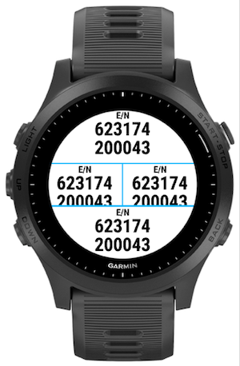

# About

Swissgrid - a Garmin [Connect IQ](https://developer.garmin.com/connect-iq/overview/) data field.

# Goal

The [Swiss coordinate system](https://www.swisstopo.admin.ch/en/knowledge-facts/surveying-geodesy/reference-systems/switzerland.html) is a geographic coordinate system used in Switzerland for maps. This app converts the GPS coordinates (WGS84) to the SwissGrid coordinates CH1903+/LV95.

Note: A sport activity (e.g. hiking) can at most only use two DataField apps. That said, it generally makes sense to create a full size DataField app which displays multiple metrics in one DataField.

# Implementation

This app implements a [DataField](https://developer.garmin.com/connect-iq/api-docs/Toybox/WatchUi/DataField.html). The layout is optimized for Garmin Forerunner 945 and the "4 Field B" bottom data field only.

The screenshots below use the Swissgrid app in the "4 Field B" layout on a Garmin Forerunner 945:

# Installation

This app is not in the Garmin [Connect IQ store](https://apps.garmin.com/).

You can use [App Side Loading](https://developer.garmin.com/connect-iq/programmers-guide/getting-started) to install the app onto the device. Copy the compiled binary to the USB mounted Garmin watch into the directory `GARMIN/Apps`. On macos you can use [Android File Transfer](https://www.android.com/filetransfer/) as macos lacks good MTP (Media Transfer Protocol) support.

Latest pre-built [binary](./build/Swissgrid.prg).
